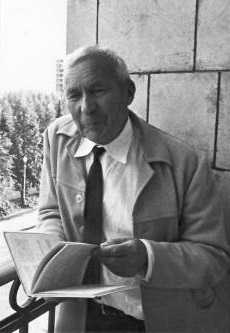
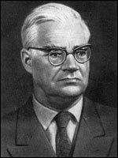
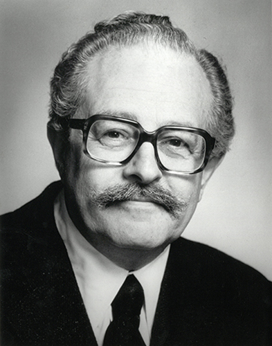

```{r setup, include=FALSE}
knitr::opts_chunk$set(echo = TRUE)
```


```{=html}
<style>
body{text-align: justify}
</style>
```
::: progress
::: {.progress-bar style="width: 100%;"}
:::
:::

# **Testes de Aderência - Caso Normal**
## **Aspectos Históricos**

Os principais testes estatísticos empregados na análise de dados clínicos e experimentais são baseados em modelos teóricos que pressupõem a **Distribuição Normal** dos dados amostrais (MIOT, 2017).

Porém, tal suposição é, muitas vezes, deixada de lado por profissionais, por diversos motivos:

-   Esquecimento;
-   Falta de Conhecimento;
-   Desconhecimento de qual o Melhor Método;

Assim, O objetivo do trabalho foi analisar o desempenho dos principais teste de normalidade implementados no Software Estatístico $R_{(4.3)}$ para decidir quais apresentam o melhor desempenho ao responder se os dados podem ser considerados normais.


::: progress
::: {.progress-bar style="width: 100%;"}
:::
:::


## **Teste de Kolmogorov-Smirnov**

È um teste não paramétrico de bondade do ajuste sobre a igualdade de distribuições de probabilidade contínuas e unidimensionais que pode ser usado para comparar uma amostra com uma distribuição de probabilidade de referência.

O nome é uma referência aso matemáticos russos **Andrei Nikolaevich Kolmogorov** e **Nikolai Vasilyevich Smirnov**. A estatística de Kolmogorov--Smirnov quantifica a distância entre a função distribuição empírica da amostra e a função distribuição acumulada da distribuição de referência.

O teste de Kolmogorov-Smirnov pode ser modificado para servir como um teste da qualidade do ajuste. No caso especial do teste da normalidade da distribuição, as amostras são padronizadas e comparadas com uma distribuição normal padrão.

::: progress
::: {.progress-bar style="width: 100%;"}
:::
:::

### **Andrei Nikolaevich Kolmogorov** {width="32" height="47"}

Kolmogorov nasceu em 25 ade abril de 1903 em Tambov, na cidade de Moscou. Foi um matemtático Russo, participou das maiores descobertas científicas do século XX, nas áreas de Probabilidade e Estatística, e em Teoria da Informação.

Em, 1933 Kolmogorov estabeleceu a definição de probabilidade por Axiomatização, na sua obra intitulada \*\*Foundations of Theory of Probability\*. Foi com base nas propriedades das frequências relativas e das operações sobre conjuntos que Kolmogorov concebeu a primeira construção Axiomática Geral para a Teoria das Probabilidades.

Considerado um dos grandes cientista em sua época, Kolmogorov foi agraciado por diversas honrarias ao longo de sua carreira:

-   Prêmio Lenin em 1941;
-   Prêmio Balzan em 1962;
-   Medalha Helmholtz em 195;
-   Prêmio Wolf de Matemática em 1980;
-   Medalha Lobachevsky em 1986;

### **Nikolai Vasilyevich Smirnov**{width="32" height="42"}

Snirnov nasceu em em 17 de outubro de 1900, em Moscou, na família de um escrivão de igreja que também trabalhava como escriturário no escritório do Teatro Bolshoi . Ele completou seus estudos de ginásio durante a Primeira Guerra Mundial , durante a qual serviu em várias unidades médicas do exército. Foi um matemático russo soviético conhecido por seu trabalho em vários campos, incluindo teoria de probabilidade e estatística.

Smirnov formou-se na Faculdade de Física e Matemática da Universidade Estadual de Moscou e, a partir de 1926, ensinou matemática por muitos anos na Academia Agrícola Timiryazev.

Smirnov recebeu o Prêmio de Estado da URSS em 1951. Em 1953 foi agraciado com a Ordem da Bandeira Vermelha do Trabalho.

::: progress
::: {.progress-bar style="width: 100%;"}
:::
:::

### **Estatística do Teste**

A função distribuição empírica $F_{n}$ para n observações $X_{i}$ independentes e identicamente distribuídas é definida como:

$$ F_{n}(x) = \frac{1}{n} \sum_{i=1}^{n} I_{[- \infty,x]}(X_{i}) $$

Em que $I_{(-\infty,x)}X_{i}$ é a função indicadora, igual a 1 se $X_{i} \leq x$ e igual a 0 de outro modo.

A estatística de Kolmogorov--Smirnov para uma dada função distribuição acumulada $F(X)$

$$ D_{n} = \displaystyle \sup_{x} \ |F_{n}(x) - F(x)|$$

em que $\displaystyle \sup_{x}$ é o supremo do conjunto de distâncias. Pelo **Teorema de Glivenko--Cantelli**, se a amostra vier da distribuição $F(X)$ entao $D_{n}$ converge a 0 quase certamente no limite quando n vai ao infinito.


#### **Função de Distribuição Empírica**

Na figura abaixo mostra-se à função de distribuição empírica correspondente à amostra obtida da distribuição Normal Padrão (0,1) enquantro a curva vermelha corresponde à distriuição teórica respectiva.


```{r}
set.seed(18340)
x = rnorm(50)
par(mar=c(4,2,1,1))
plot(ecdf(x), 
     xlim = range(c(-3, 3)), 
     main = "", 
     ylab="")
text(0,0.8,expression(F[n](x)))
curve(pnorm(x), 
      add = TRUE, 
      col = "red", 
      lwd = 2)
rug(x)
```


### **Hipóteses do Teste**

As Hipóteses do teste de kolmogorov-smirnov são:

$$
H_{0}: a \ diferença \ entre \ frequências \ observadas \ e \ esperadas \ é \ pequena \ ou \  F_{0}(X) - S_{n}(X) \approx 0.    \\ 
H_{1}: Caso \ Contrário.
$$

### **Nível de Significância do Teste**

Escolha de um nível de a $\alpha = 0.05$ ou $\alpha = 0.01$, sendo teste de natureza bicaudal.

### **Regra de Decisão do Teste**

Observando o $p-valor$ maior que $0.05$, concluí-se que $\textbf{Não}$ há evidências para Rejeitar $H_{0}$, caso contrário, se o $p-valor$ seja menor que $0.05$.


O teste de kolmogorov-smirnov pode ser aplicado utilizando a função **ks.test()** do **pacote stats** do software **R\_{4.3.2}** versão windows.


::: progress
::: {.progress-bar style="width: 100%;"}
:::
:::


## **Teste de Shapiro-Wilk**

È um teste de normalidade publicado em 1965 por **Samuel Sanford Shapiro** e **Martin Wilk** e se baseia na regressão dos valores amostrais ordenados com as correspondentes estatísticas de seis ordens normais que, para uma amostra de uma população normalmente distribuída, é linear (ROYSTON, 1982).

### **Samuel Sanford Shapiro** {width="32"}

Samuel nasceu na cidade de Nova York , Shapiro formou-se em estatística no **City College of New York** em 1952, e fez mestrado em engenharia industrial na **Universidade de Columbia** em 1954. Ele serviu brevemente como estatístico no Corpo Químico do Exército dos EUA, antes de obter um mestrado (1960) e um doutorado (1963) em estatística na **Rutgers University**. Em 1972 ingressou no corpo docente da **Florida International University**.

### **Martin Bradbury Wilk** {width="32"}

Martin nasceu em Montreal, Quebec, ele recebeu o diploma de bacharel em engenharia química pela **Universidade McGill** em 1945. Durante o período de 1951 a 1955, obteve o título de mestrado e doutorado em estatística pela **Iowa State University**.

O teste de Shapiro-Wilk testa a hipótese nula de que uma amostra $x_{1}, \ldots, x_{n}$ veio de uma população normalmente distribuída. A estatística de teste é:

$$ W = \frac{(\sum_{i=1}^{n} a_{i}x_{i})^{2}}{\sum_{i=1}^{n}(x_{i}-\bar{x})^{2}}$$

O teste de shapiro-wilk pode ser aplicado utilizando a função **shapiro.test()** do **pacote stats** do software **R\_{4.3.2}** versão windows.

::: progress
::: {.progress-bar style="width: 100%;"}
:::
:::

## **Teste de Jarque-Bera** 

È um teste de qualidade de ajuste para verificar se os dados da amostra têm assimetria e curtose correspondentes a uma distribuição normal . A prova leva o nome de **Carlos M. Jarque Uribe** e **Anil K. Bera**. A estatística de teste é sempre não negativa. Se estiver longe de zero, sinaliza que os dados não têm distribuição normal.


### **Carlos M. Jarque Uribe** {width="32" height="42"}

Carlos Jarque (nascido em 18 de outubro de 1954 na Cidade do México) é um economista mexicano, atualmente Diretor Executivo da América Móvil e Membro do Conselho do Grupo Líder Global em Serviços ao Cidadão FCC (Fomento de Construcciones y Contratas). Teve uma carreira destacada no sector privado, na função pública (nacional e multilateral) e no mundo académico.

Jarque é formado em Ciências Atuariais pela **Universidade Anahuac**, na Cidade do México. Ele tem Pós-Graduação em Estatística e Mestrado em Econometria pela **London School of Economics**; Certificado de Pós-Graduação em Política Econômica e Planeamento Urbano e Regional pela Universidade de Oslo; Doutorado em Economia (Ph.D) pela **Australian National University**; e pós-doutorado em Economia pela **Universidade de Harvard**.


### **Anil K. Bera** {width="32" height="32"}

Anil K. Bera (nascido em 1955) é um econometrista indiano-americano. Ele é professor de Economia na **Universidade de Illinois** no Departamento de Economia de Urbana -- Champaign.

Bera nasceu em uma remota vila de Paschimchak, Bengala Ocidental , Índia. Seu pai era um médico que não cobrava honorários formais de seus pacientes e dependia de contribuições voluntárias.

Bera recebeu um Bacharelado da Universidade de Calcutá em 1975 em Estatística, mestrado pelo Indian Statistical Institute em 1977 em Econometria e Planejamento (Primeira Classe) e doutorado. em 1983 pela Australian National University (Phd Aspects of Econometric Modeling).

A estatística do teste de Jarque-Ber é definida como:

$$ JB = \frac{n}{6} (S^{2} + \frac{1}{4}+(K-3)^{2}) $$

onde n é o número de observações(ou graus de liberdade em geral); S é a assimetria da amostra; K é a curtose da amostra:

$$S=\frac{\hat{\mu_{3}}}{\hat{\sigma^{3}}} = \frac{\frac{1}{n} \sum_{i=1}^{n} (x_{i}-\bar{x})^{3}}{\frac{1}{n} \sum_{i=1}^{n} (x_{i}-\bar{x})^{2})^{\frac{3}{2}}}$$ e

$$ K = \frac{\hat{\mu_{4}}}{\hat{\sigma^{4}}} = \frac{\frac{1}{n} \sum_{i=1}^{n} (x_{i}-\bar{x})^{4}}{\frac{1}{n} \sum_{i=1}^{n} (x_{i}-\bar{x})^{2}}$$

onde $\hat{\mu_{3}}$ e $\hat{\mu_{4}}$ são as estimativas do terceiro e quarto momentos centrais, respectivamente, $\bar{x}$ é a média amostral e $\hat{\sigma}^{2}$ é a estimativa do segundo momento central, a variância.

Se os dados vierem de uma distribuição normal, a estatística JB tem assintoticamente uma distribuição qui-quadrado $(\chi^{2})$ com dois graus de liberdade, portanto a estatística pode ser usada para testar a hipótese de que os dados são de uma distribuição normal.

Esta estatística é simples e seu poder se mostrou comparável a outros testes poderosos. O teste JB Esta programado na função **JarqueBeraTest()** no **pacote DescTools** do **R\_{4.3.2}**.

::: progress
::: {.progress-bar style="width: 100%;"}
:::
:::

# **Material e Métodos**

A simulação Moonte Carlos foi utilizada para simular amostras normais sob a hipótese nula de normalidade, $H_{0}$, para avaliar as taxas de erro tipo I dos testes e amostras sob a hipótese alternativa $H_{1}$, ou seja, dados de distribuição não normais para avaliar o poder.

Em cada situação, os testes de normalidade foram aplicados ao nível nominal de significância pré-definido $\alpha$ com o valor de 0.05.

Se o teste rejeita a hipótese nula e a amostra é da distribuição normal comete-se um erro tipo I e, se não for normal, uma decisão correta foi tomada.

## **Simulação e Poder dos Testes**

Foram efetuadas $N=1000$ simulações sob $H_{0}$ e sob $H_{1}$. Cada simulação de cada distribuição produziu amostras de tamanho $n$ e esses valores foram: 10,20,50,100,500 e 1000.

Os teste de normalidade foram aplicados em cada uma da $N = 1000$ amostras de cada distribuição simulada e a proporção de rejeições corretas da hipótese nula foi computada. Os valores obtidos representam o poder dos testes, que foram comparados entre si.

::: progress
::: {.progress-bar style="width: 100%;"}
:::
:::

# **Resultados e Discussões**

Os resultados serão apresentados de acordo com as taxas de erro tipo I, na situação de distribuição normal, e poder, na situação de outras distribuições.

## **Pacotes Utilizados**

```{r message=FALSE, warning=FALSE}
library(DistributionTest)
library(moments)
library(nortest)
library(DescTools)
library(fBasics)
library(dplyr)
library(tidyr)
library(ggplot2)
#library(kableExtra)
library(knitr)
library(tinytex)
library(Publish)
```


## **Simulação**


```{r amostra, message=FALSE, warning=FALSE}
# Tamanho de Amostra
Resultados <- NULL
NN <- 10

# Repetição
escopo <- expand.grid(
  tamanho_amostra = seq(25, 30, 5),
  repeticao = seq(1, NN)
)

Resultados <- purrr::map2_dfr(escopo$tamanho_amostra,escopo$repeticao, function(tamanho_amostra, ii){
  print(paste0(tamanho_amostra, "-", ii))
  #x <-rcauchy(tamanho_amostra, 0,1)
  x <-rnorm(tamanho_amostra, 0,1)
  #x <- rgamma(tamanho_amostra, shape = 10, rate = 1/10)
  tibble(
    Kolmogorov_Smirnov = ks.test(x, pnorm, mean(x), sd(x))$p.value,
    Jarque_Bera = JarqueBeraTest(x)$p.value,
    Anderson_Darling = AndersonDarlingTest(x, null = "pnorm", mean(x), sd(x))$p.value,
    Lilliefors = LillieTest(x)$p.value,
    Shapiro_Wilk = shapiro.test(x)$p.value,
    Cramer_Von_Mises = cvm.test(x)$p.value,
    D_Agostino = agostino.test(x)$p.value,
    ZK = zk.test(x, 'norm')$p.value,
    ZC = zc.test(x, 'norm')$p.value,
    ZA = za.test(x, 'norm')$p.value,
    amostra = tamanho_amostra,
    tentativa = ii
  )
}
)
```


::: progress
::: {.progress-bar style="width: 100%;"}
:::
:::


## **Comparação do P-valor**


```{r comparacao, message=FALSE, warning=FALSE}
Resultados |>
  tidyr::pivot_longer(
    names_to = "modelo",
    values_to = "estatistica",
    cols = c(Kolmogorov_Smirnov,
             Jarque_Bera,
             Anderson_Darling,
             Lilliefors,
             Shapiro_Wilk,
             Cramer_Von_Mises,
             D_Agostino,
             ZK,
             ZC,
             ZA))|>
  group_by(amostra, modelo)|>
  summarise(
    minimo = min(estatistica),
    mediana = mean(estatistica),
    maximo = median(estatistica)+sd(estatistica))|>
  ggplot(aes(x = amostra, y = mediana, ymin = minimo, ymax =  maximo, 
             color = modelo))+
  geom_line()+
  geom_jitter()+
  geom_point()+
  ggtitle("Comparação do P-valor Médio")+
  theme_bw()+
  scale_y_continuous(labels = scales::percent, limits = c(0,1))+
  labs(x = "Tamanho Amostral", 
       y = "Erro Tipo I", 
       color = "Tipos de Testes")
```


```{r message=FALSE, warning=FALSE}
#Resultados |>
# kbl(caption = "Resultados dos Testes de Bondade de Ajuste.",
#      round=2) |>
#  kableExtra::kable_classic(full_width = FALSE, 
#                            html_font = "Cambria",
#                            font_size = 12)
#|> footnote("Tabela resumo os p-valores pra cada teste.")
```


::: progress
::: {.progress-bar style="width: 100%;"}
:::
:::


## **Poder do Teste**

A figura 2 Estão apresentados os valores de poder para os oito testes em função do tamanho da amostra n para distribuição gamma.


```{r poder, message=FALSE, warning=FALSE}
Resultados |>
  tidyr::pivot_longer(
    names_to = "modelo",
    values_to = "estatistica",
    cols = c(Kolmogorov_Smirnov,
             Jarque_Bera,
             Anderson_Darling,
             Lilliefors,
             Shapiro_Wilk,
             Cramer_Von_Mises,
             D_Agostino,
             ZK,
             ZC,
             ZA))|>
  group_by(amostra, modelo)|>
  summarise(
    minimo = min(estatistica),
    mediana = mean(estatistica < .05),
    maximo = median(estatistica)+sd(estatistica))|>
  ggplot(aes(x = amostra, y = mediana, ymin = minimo, ymax =  maximo, color = modelo))+
  geom_line()+
  geom_jitter()+
  geom_point()+
  ggtitle("Comparação do Poder do Teste", subtitle = "Simulação")+
  theme_bw()+
  scale_y_continuous(labels = scales::percent, limits = c(0,1))+
  labs(x = "Tamanho Amostral", 
       y = "Poder do Teste", 
       color = "Tipos de Testes")
```


::: progress
::: {.progress-bar style="width: 100%;"}
:::
:::


# **Referências Bibliográficas**

ANDERSON, T. W.; DARLING, D. A. A test of goodness of t.Journal of AmericanStatistical Association, v.49, p. 765-769, 1954.

D`AGOSTINO, R. B. Transformation to Nomality of the Null Distribution of G1.Biome-trika, v.57, n.3, p.679-681, 1970

Jarque CM, Bera AK (1987). “A Test for Normality of Observations and Regression Residuals.” International Statistical Review. Revue International de Statistique, 55(2), 163–172.
doi:10.2307/1403192.

Kolmogorov, A., Sulla determinazione empirica di una legge di distributione,
Giornale dell’ Istituto Italiano degli Attuari 4 (1933), 83–91.

LILLIEFORS, H. W. On the Kolmogorov-Smirnov test for normality with mean and vari-ance unknown.Journal of American Statistical Association, v.62, p.534-544, 1967.

SHAPIRO, S. S.; WILK, M. B. An analysis of variance test for normality (complete sam-ples).Biometrika, v.52, p. 591-611, 1965.


Zhang J (2002). “Powerful Goodness-of-Fit Tests Based on the Likelihood Ratio.” Journal of
the Royal Statistical Society B, 64(2), 281–294. doi:10.1111/1467-9868.00337.


::: progress
::: {.progress-bar style="width: 100%;"}
:::
:::


